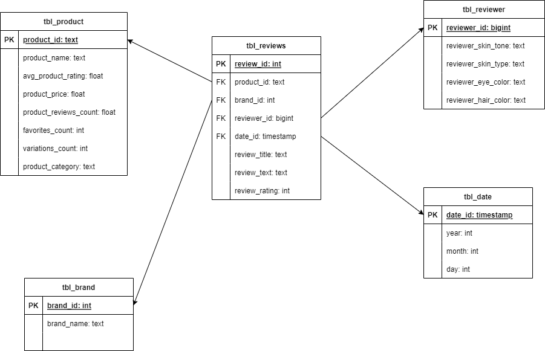

# Data Engineering Apprenticeship Program Final Project 
## Project Description
- In this project, I have created a simple ETL pipeline that extracts the data from 2 csv files, then I transform the extracted data to create fact and dimension tables of data warehouse, finally I load the data into the data warehouse.
- As, I am doing this project with main objective of learning and exploring new technologies, I will be implementing etl pipeline and data warehouse using different methods.
    1. Using Python, Pandas and Postgresql to create ETL pipeline and data warehouse
    2. Using AWS services (S3, Glue, Athena, Redshift) to create ETL pipeline and data warehouse 
## Objectives
- To create a complete ETL pipeline and datawarehouse

## Original Dataset:
[Sephor Products and Skincare Reviews](https://www.kaggle.com/datasets/nadyinky/sephora-products-and-skincare-reviews)  
I have chosen the following two datasets from this dataset for my project:
1. product_info.csv => Contains description of individual products
2. product_reviews.csv => Contains product reviews by different customers

## Data Model
I am planning to implement the datawarehouse using star schema with a fact table and 4 dimension tables as shown in the data model below:  

## Directory Structure
1. **etl_pipeline_data_warehouse_python_postgres.ipynb** contains implementation of etl pipeline and datawarehouse using Python and Postgresql
2. **etl_pipeline_data_warehouse_aws.ipynb** contains implementation of etl_pipeline and datawarehouse using aws services
3. **datasets** contains all dataset files
4. **diagrams** contains various diagrams including outputs.

## Project Status
- ETL pipeline and Data warehouse using Python and Postgresql - _**DONE**_
- ETL pipeline and Data warehouse using AWS services - _**IN_PROGRESS**_